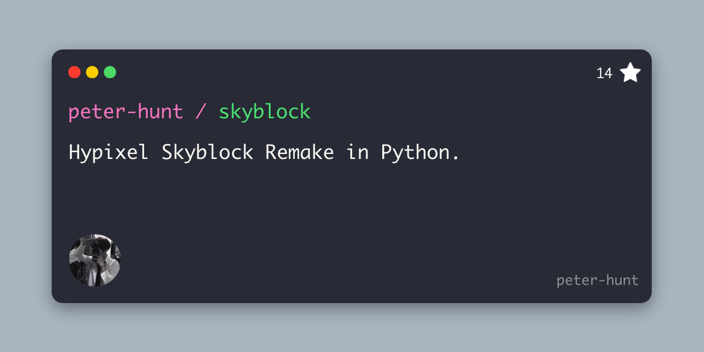
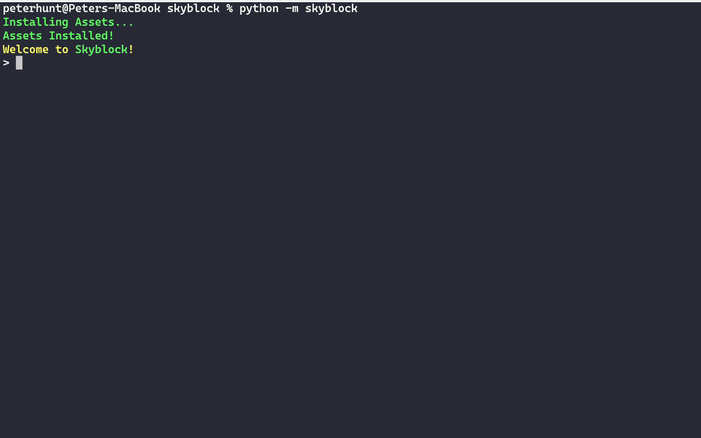
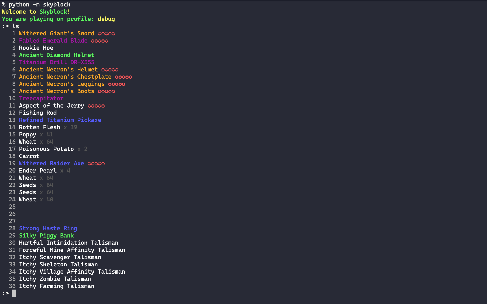
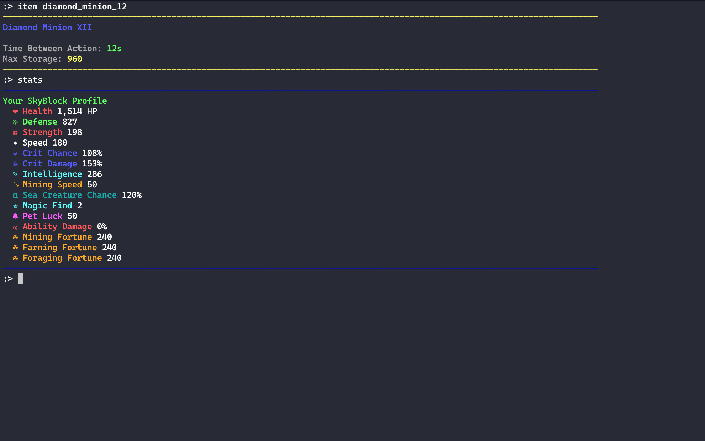
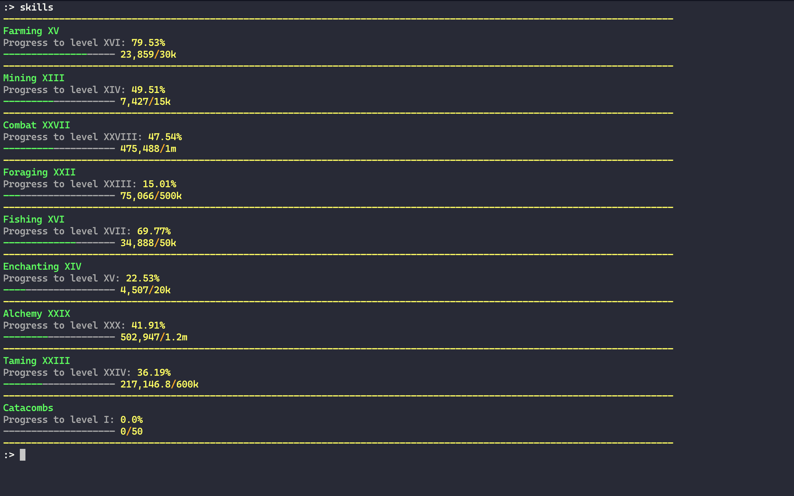
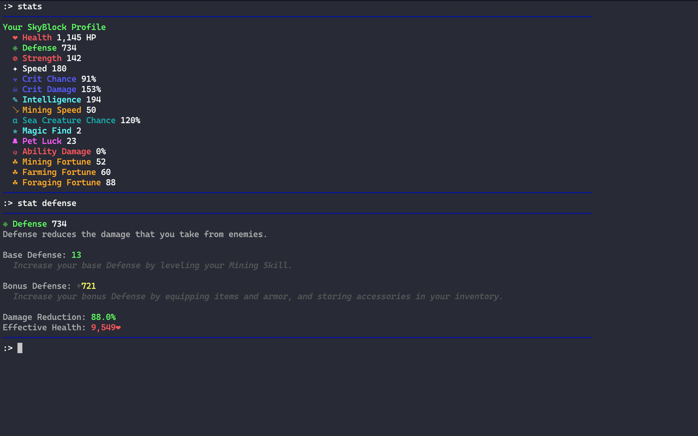
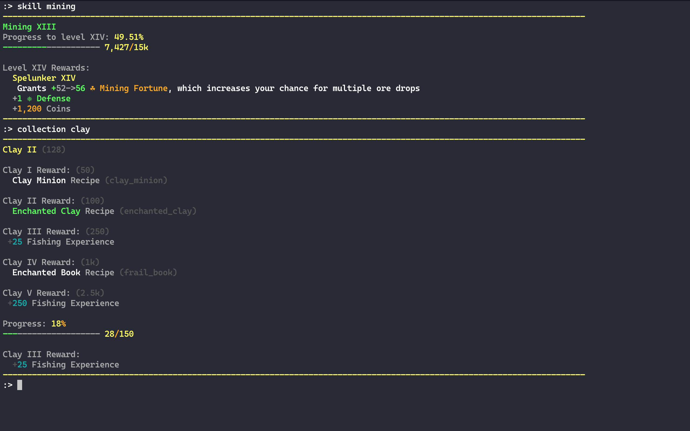

# Skyblock Beta




## Hypixel Skyblock Remake in Python.

**This project is a command-line-based fantasy RPG game.** You type commands to play the game. **Many mechanics and content are different from the original Hypixel Skyblock**, but I'm trying to make it as close to the original Hypixel Skyblock as possible.

I started this project because **my friends couldn't log onto Hypixel**. I'm also learning many of the mechanics and getting better at Hypixel Skyblock by the time.

I chose Python because **I'm the most familiar with Python**. Plus, Python code is more readable and understandable than most of the other languages. And since this is a command-line project, which doesn't need to run fast, Python is the choice.

It requires the Skyblock Data repo, [Skyblock Data](https://github.com/peter-hunt/skyblock-data), which **will install and update automatically** (the main program updates the data every 12 hours).

# Table of Contents

- [Skyblock Beta](#skyblock-beta)
  - [Hypixel Skyblock Remake in Python.](#hypixel-skyblock-remake-in-python)
- [Table of Contents](#table-of-contents)
- [Reasons for installing Skyblock](#reasons-for-installing-skyblock)
- [Credits](#credits)
- [License](#license)
- [Warnings](#warnings)
- [Installation](#installation)
  - [With Pip](#with-pip)
  - [With Git](#with-git)
- [Usage](#usage)
- [Content](#content)
  - [Added Features:](#added-features)
  - [Planned Features:](#planned-features)
- [Example Saves](#example-saves)
- [Screenshots](#screenshots)
- [How to Contribute](#how-to-contribute)
- [Helpful Links](#helpful-links)

# Reasons for installing Skyblock

Well, if you **don't want to buy Minecraft for 26.95 dollars**, and you **still want to play Hypixel Skyblock**, then this project is for you.

The project is also for people who **can't connect to Hypixel or having a bad connection**.

Even more, if you want to **play Skyblock cheaty**, then cheating on this project won't cost you a single dollar, even getting admin items or having trillions of coins. And if you want to **make your custom content or mod it**, this project is for you.

# Credits

Quotes from Simon are shown on [BlueCommander](https://www.youtube.com/c/BlueCommander)'s [Hypixel Skyblock Recreate release video](https://youtu.be/GvsjASwuZv4?t=80).

**Simon's quotes contain rules about remaking Hypixel Skyblock**, including not charging clones for money, not for monetization uses, not confusing other players thinking that this is the real Hypixel Skyblock. **This project is among all of the rules above, which could make this project valid**, but I haven't contracted with Hypixel staff for official permission yet.

Social preview image generated by [Bannerbear](https://bannerbear.com).

# License

[MIT](LICENSE.txt)

# Warnings

**This project is still in heavy development**, so the data structures used for caching and saving data will change. If you'd like to play this game in Beta, and your saved files get out of date or just from strange bugs, your files can corrupt.

If your data folder corrupts, delete the whole `~/skyblock/data` folder to let the program fix it.

If your saved files go corrupt, then it's probably not going to be resolved.

# Installation

Use pip or git to install Skyblock as a Python library so you can run the game anywhere.

## With Pip

Use pip to install the project straight as an executable library.

```bash
pip install git+https://github.com/peter-hunt/skyblock.git
```

## With Git

Or, to install from the source, use git to clone the source code.

```bash
git clone https://github.com/peter-hunt/skyblock.git
```

To install the library from the source, go into the directory and:

```bash
python setup.py install
```

**This project requires Python 3.8+**

# Usage

```bash
python -m skyblock
```

Upon your first successful execution of the project, you should see something like this:


To check command usage, type `help` for command documentation.

# Content

## Added Features:

* Abilities
* Accessories
* Armor Pieces, Tools, and Weapons
* Bestiaries and Bestiary Milestones
* Crafting
* Collections
* Combining Enchantments, Reforge Stone, and Potato Books
* Farming, Mining, Simple Combat, Foraging, Fishing, and Enchanting
* Fast Traveling
* NPC Buying and Trading items
* Minions
* Modifiers and Reforging
* Pets and Pet Score
* Skills

## Planned Features:

* Brewing and Potion effects
* Commissions
* Diana, Griffin Pet and Mythologicals
* Dungeons
* Fairy Souls
* Forging (Dwarven Mines) (Forging recipes already are accessable)
* HoTM Skill Tree (Dwarven Mines)
* Mayors and Unique Perks
* Minion Support Items
* NPC Usage (like Kat, Fetchur, etc.)
* Pet Support Items
* Templates organized into files for translation update (abilities included)

# Example Saves

There's some example game save file in the [example](./example) folder. The example files are used in the introduction video. (coming soon)

You can view the saves with the following links, or copy the following files under the `~/skyblock/saves` folder to play it.

The following `Example Game` is my test game, which is achievable in-game.

* [Example Game](example/game.json)
* [Pro Game](example/pro.json)  (based on YouTuber 56ms's Strawberry profile in January 2022)

Some of the items, enchantments, and so on in the future Pro save is currently unobtainable in-game.

# Screenshots

Here's some footage on the gameplay:








# How to Contribute

[CONTRIBUTING.md](CONTRIBUTING.md)

# Helpful Links

* [Hypixel Website](https://hypixel.net)
* [Hypixel Skyblock Wiki](https://hypixel-skyblock.fandom.com/wiki/Hypixel_SkyBlock_Wiki)
* [Skyblock Data Repo](https://github.com/peter-hunt/skyblock-data)
* [My Patreon Page](https://www.patreon.com/peter_hunt)
